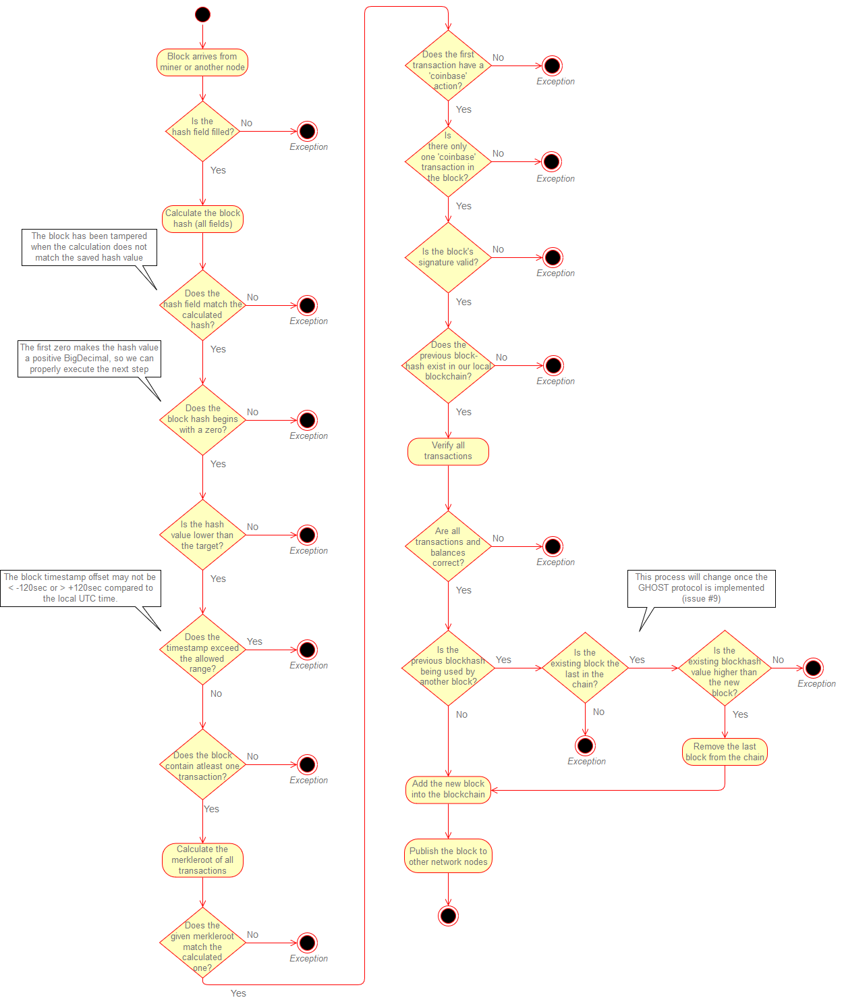

# Block validation
The consensus algorithm validates blocks by using the following steps: 

The [PowBlockValidator.cs](../src/Logistichain.Consensus/BlockLogic/PowBlockValidator.cs) contains the block validation algorithm.

## Validating transactions
The block validation process also uses the [transaction validation process](TxValidation.md).