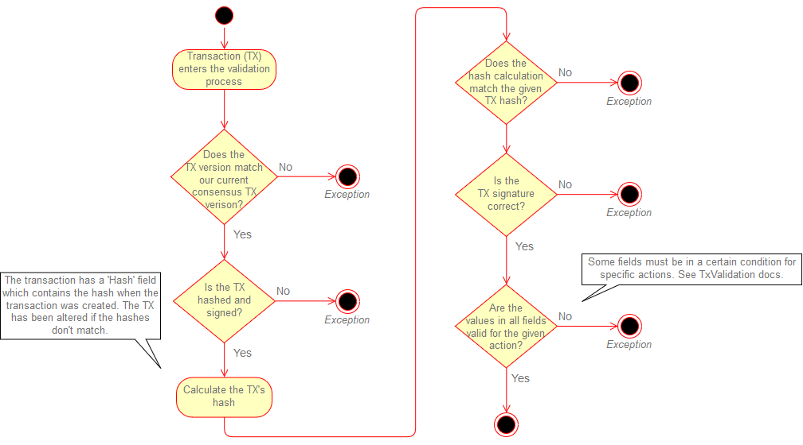

# Transaction validation
The validation of the transactions will be performed by the [StateTransactionValidator.cs](../src/Logistichain.Consensus/TransactionLogic/StateTransactionValidator.cs). The validation will follow the next steps:

## Transaction states
For each action, a transaction must be in a certain state. The table below specifies the conditions for all fields for each action in order to be validated by the consensus algorithm correctly.

|  Actions →   Fields ↓ | TransferToken                                        | TransferSupply                                                      | DestroySupply                                                       | CreateSupply                                                        | CreateSku                                        | ChangeSku                                                                                | ClaimCoinbase                  |
|-----------------------|------------------------------------------------------|---------------------------------------------------------------------|---------------------------------------------------------------------|---------------------------------------------------------------------|--------------------------------------------------|------------------------------------------------------------------------------------------|--------------------------------|
| **FromPubKey**            | Any non-empty value                                  | Any non-empty value                                                 | Any non-empty value                                                 | Value equal to FromPubKey value from the referenced CreateSku tx    | Any non-empty value                              | Value equal to FromPubKey value from the referenced CreateSku tx                         | Must be null                   |
| **ToPubKey**              | Any non-empty value                                  | Any non-empty value                                                 | Must be null                                                        | Any non-empty value                                                 | Any non-empty value                              | Equal to FromPubKey                                                                      | Any non-empty value            |
| **SkuBlockHash**          | Unchecked                                            | Reference to block hash where the SKU was created ('CreateSku')     | Reference to the block hash where the SKU was created ('CreateSku') | Reference to the block hash where the SKU was created ('CreateSku') | Must be null                                     | Reference to the block hash where the SKU was created ('CreateSku')                      | Must be null                   |
| **SkuTxIndex**            | Unchecked                                            | Reference to the tx index from SkuBlockHash                         | Reference to the tx index from SkuBlockHash                         | Reference to the tx index from SkuBlockHash                         | Unchecked                                        | Reference to the tx index from SkuBlockHash                                              | Unchecked                      |
| **Amount**                | Amount in tokens + Fee >= tokenbalance of FromPubKey | Amount in supply >= supplybalance of FromPubKey (for the given SKU) | Amount in supply >= supplybalance of FromPubKey (for the given SKU) | New supply amount > 0                                               | New supply amount >= 0                           | Must be zero                                                                             | Amount in (new) tokens <= 5000 |
| **Fee**                   | Fee >= 10                                            | Fee >= 1 and Fee >= tokenbalance of FromPubKey                      | Fee >= 1 and Fee >= tokenbalance of FromPubKey                      | Fee >= 100 and Fee >= tokenbalance of FromPubKey                    | Fee >= 100 and Fee >= tokenbalance of FromPubKey | Fee >= 100 and Fee >= tokenbalance of FromPubKey                                         | Must be zero                   |
| **Data**                  | Unchecked                                            | Unchecked                                                           | Unchecked                                                           | Unchecked                                                           | JSON-serialized SkuData object                   | JSON-serialized SkuData object, SkuId is the same as stated in the CreateSku transaction | Unchecked                      |

*This table is also available in [Word](Architecture/Transaction-states.docx) and [PDF](Architecture/Transaction-states.pdf) format.*

For the latest fees, coinbase rewards and other consensus rules, see [BlockchainConstants.cs](../src/Logistichain.Shared/Constants/BlockchainConstants.cs).